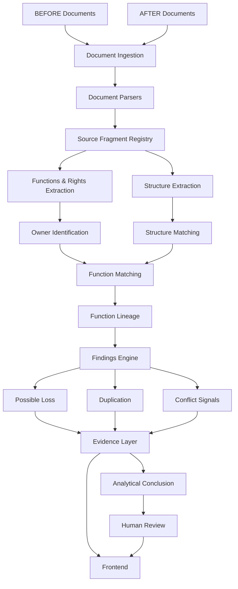

# OrgTrace AI

*Explainable organizational intelligence for restructuring analysis*

**OrgTrace AI** анализирует организационные документы **ДО и ПОСЛЕ реорганизации**, отслеживает судьбу подразделений, функций, полномочий и зон ответственности и показывает, **какими исходными положениями документов подтверждается каждый существенный вывод**.

> **Не просто сравнение двух файлов.
> OrgTrace AI показывает, что произошло с каждой функцией организации.**

**Upload → Analyze → Structure Diff → Function Lineage → Finding → Evidence → Conclusion → Human Review**

## Verified Hackathon Prototype

| Проверка                  |          Результат |
| ------------------------- | -----------------: |
| Automated tests           |   **54 / 54 PASS** |
| TypeScript typecheck      |           **PASS** |
| Lint                      |           **PASS** |
| Production build          |           **PASS** |
| Synthetic scenarios       |   **S01–S06 PASS** |
| Original DOCX smoke       |           **PASS** |
| Acceptance evaluation     |   **47 / 47 PASS** |
| Browser E2E flow          |           **PASS** |
| Backend                   |   **Real backend** |
| Mock mode                 | **`isMock=false`** |

Метрики разбора и анализа контрольной пары — в разделе [Real Document Validation](#real-document-validation).

Проверенный application SHA:

```text
f4dadd8254806b47c6f44d7900396fe9f9e22bdc
```

Финальные изменения документации не изменяют проверенный application code.

## Что решает OrgTrace AI

При реорганизации недостаточно сравнить названия подразделений или найти изменившиеся строки.

Одна и та же функция может:

* сохраниться без изменений;
* изменить формулировку;
* перейти другому подразделению;
* разделиться между несколькими владельцами;
* оказаться продублированной;
* потенциально исчезнуть;
* создать пересечение полномочий или зон ответственности.

При ручном сравнении больших редакций организационных положений такие изменения легко пропустить.

OrgTrace AI отвечает на более важный вопрос:

> **Что произошло с каждой функцией между состоянием ДО и состоянием ПОСЛЕ — и какими фрагментами документов это подтверждается?**

## Главная идея — Function Lineage

Главный объект анализа OrgTrace AI — не документ и не отдельная строка.

Главный объект анализа — **функция организации**.

```text
BEFORE

Department A
└── Function X
        │
        │  OrgTrace AI
        ▼
AFTER

Department B
└── Function X

Result:
TRANSFERRED

Evidence:
BEFORE → source clause
AFTER  → source clause
```

Система строит **Function Lineage** — трассировку функции между двумя состояниями организации.

Поддерживаемые состояния включают:

* `UNCHANGED` — функция сохранена;
* `MODIFIED` — функция изменилась;
* `TRANSFERRED` — функция перешла другому владельцу;
* `POSSIBLE_LOSS` — возможно, функция потеряна.

Это позволяет анализировать **семантическое изменение функционала**, а не только текстовые различия документов.

## Чем OrgTrace AI отличается от обычного document diff

Обычный diff отвечает:

> «Какие строки изменились?»

OrgTrace AI отвечает:

> **«Что произошло с функцией?»**

Например:

```text
ДО

Департамент A
→ Контроль финансовых рисков

ПОСЛЕ

Департамент B
→ Контроль финансовых рисков
```

Текстовое сравнение может показать изменения в документах.

OrgTrace AI определяет, что функция не исчезла, а **перешла другому владельцу**.

```text
Function:
Контроль финансовых рисков

BEFORE owner:
Department A

AFTER owner:
Department B

Status:
TRANSFERRED
```

## Основной workflow

```text
Документы ДО
      +
Документы ПОСЛЕ
      │
      ▼
Parsing
      │
      ▼
Source Fragments + Locators
      │
      ▼
Structure Extraction
      │
      ▼
Functions / Rights Extraction
      │
      ▼
Owner Identification
      │
      ▼
Structure Matching
      │
      ▼
Function Matching
      │
      ▼
Function Lineage
      │
      ├── UNCHANGED
      ├── MODIFIED
      ├── TRANSFERRED
      └── POSSIBLE_LOSS
      │
      ▼
Risk Detection
      │
      ├── Possible Loss
      ├── Duplication
      └── Conflict Signal
      │
      ▼
Evidence
      │
      ▼
Conclusion
      │
      ▼
Human Review
```

## Core Capabilities

### 1. BEFORE / AFTER Document Analysis

Пользователь загружает два состояния организации:

#### BEFORE / ДО

Документы до реорганизации.

#### AFTER / ПОСЛЕ

Документы после реорганизации.

Проверенный прототип принимает:

* DOCX;
* PDF;
* XLSX.

Степень проверки форматов различается и подробно описана ниже в разделе **Format Validation**.

### 2. Structure Diff

OrgTrace AI извлекает организационные сущности и сравнивает структуру ДО и ПОСЛЕ.

Система может показывать:

* сохранённые подразделения;
* преобразованные подразделения;
* новые подразделения;
* удалённые подразделения;
* связанные структурные изменения.

### 3. Function Lineage

Система извлекает функции и полномочия вместе с владельцами и пытается определить их судьбу между редакциями документов.

Пример:

```text
BEFORE
Department A
└── Function X

              ↓

AFTER
Department B
└── Function X

Status: TRANSFERRED
```

Смена владельца не интерпретируется автоматически как потеря функции.

### 4. Possible Function Loss

Если функция присутствует в BEFORE, система ищет её продолжение в AFTER.

Поиск не ограничивается подразделением с похожим названием.

```text
BEFORE

Department A
→ Function X

AFTER

Department B
→ Function X
```

В таком сценарии функция может быть классифицирована как:

```text
TRANSFERRED
```

а не:

```text
POSSIBLE_LOSS
```

`POSSIBLE_LOSS` является диагностическим сигналом и требует проверки человеком.

### 5. Possible Duplication

OrgTrace AI выявляет случаи, когда похожий функционал закреплён одновременно за несколькими владельцами.

Система не утверждает автоматически, что это доказанное организационное нарушение.

Результат интерпретируется как:

> **Potential duplication candidate**

и передаётся на Human Review.

### 6. Conflict Signals

Система может выявлять потенциальные пересечения функций, ролей, полномочий или зон ответственности, а также должность, указанную в перечнях подчинения у нескольких руководителей.

Такие сигналы являются рекомендательными и требуют экспертной проверки: функциональное и административное подчинение могут различаться по замыслу документа.

### 7. Режим анализа и происхождение выводов

Результат сообщает, какими средствами он получен: применялись ли embeddings и языковая модель, сколько было обращений к модели и сколько ответов пришло из кэша, а также на каких этапах анализ перешёл в резервный режим.

Панель «Режим анализа» показывает это на дашборде, а каждое замечание и каждая строка связей функций несут бейдж метода:

```text
Правило                — детерминированное правило по тексту и структуре
Текстовое сходство     — сравнение нормализованных формулировок без модели
Семантическое сходство — близость векторных представлений
ИИ                     — интерпретация модели, проверенная по дословной цитате
```

Если AI отключён или недоступен, предупреждение о резервном режиме показывается над результатами: счётчики собираются из фактических вызовов, поэтому непроизошедшее обращение к модели не может быть объявлено выполненным.

## Evidence — ключевой слой системы

Главный принцип OrgTrace AI:

> **Ни один существенный вывод не должен существовать отдельно от источника.**

Для finding система сохраняет связь с evidence:

```text
Finding
│
├── Risk type
│
├── Function
│
├── BEFORE owner
│
├── AFTER owner
│
├── BEFORE document
│
├── AFTER document
│
├── Locator / clause
│
├── Source fragment
│
└── Review status
```

Evidence может включать:

* исходный документ;
* BEFORE / AFTER state;
* владельца функции;
* locator;
* пункт документа;
* исходный текстовый фрагмент;
* связь `finding → evidence`.

Пользователь может открыть finding и проверить, на каких положениях документа основан вывод.

## Не просто вывод — прослеживаемая цепочка

OrgTrace AI строится вокруг цепочки:

```text
Requirement
    ↓
Document
    ↓
Fragment
    ↓
Function
    ↓
Matching
    ↓
Finding
    ↓
Evidence
    ↓
Conclusion
    ↓
Human Review
```

Для QA используется аналогичный принцип:

```text
Requirement
    ↓
Implementation
    ↓
Test
    ↓
Result
    ↓
Evidence
```

## Human Review

OrgTrace AI — система поддержки принятия решений.

Она не должна автоматически заменять юридическую, организационную или управленческую экспертизу.

Для findings предусмотрены статусы:

* **Confirm**
* **Reject**
* **Needs Review**

Эксперт также может сохранить комментарий.

Human Review особенно важен для:

* потенциальной потери функции;
* возможного дублирования;
* неоднозначного владельца;
* сложного переноса полномочий;
* потенциального конфликта;
* диагностических findings.

## Analytical Conclusion

После анализа система формирует итоговое заключение.

Оно может содержать:

* изменения структуры;
* изменения функционала;
* переданные функции;
* изменённые функции;
* возможные потери;
* возможные дублирования;
* потенциальные конфликтные сигналы;
* вопросы, требующие Human Review.

Критический принцип:

> **Диагностический сигнал не должен автоматически превращаться в доказанный организационный факт.**

## Example Finding

Пример логики finding:

```text
Function:
Контроль функции X

BEFORE:
Department A
Clause 5.4.4(b)

AFTER:
Department B
Clause 5.3.3(b)

Relation:
TRANSFERRED

Evidence:
✓ BEFORE source found
✓ AFTER source found

Review:
Needs Review
```

Таким образом, пользователь видит не только classification, но и путь:

```text
Finding
→ Function
→ BEFORE owner
→ AFTER owner
→ Original clauses
→ Human decision
```

## Architecture



## Architecture Principles

Хакатонный прототип сознательно построен как компактная система.

Приоритеты:

* reproducibility;
* traceability;
* explainability;
* end-to-end reliability;
* быстрый локальный запуск;
* Human Review.

Для рабочего прототипа не добавлялись инфраструктурные компоненты, которые не были необходимы для демонстрационного сценария.

Это позволяет запустить проверенный режим без:

* отдельной vector database;
* graph database;
* message queue;
* Kubernetes;
* отдельной production database.

Jobs сохраняются локально в:

```text
.data/
```

## Semantic Engine

Проверенный режим текущей версии преимущественно использует:

> **deterministic / rule-based extraction and matching**

Мы сознательно не заявляем, что все проверенные результаты текущей версии были получены live LLM.

Это позволяет сохранить:

* воспроизводимость;
* контролируемость;
* связь с конкретными источниками;
* предсказуемое поведение demo-flow.

При этом архитектура проекта предусматривает развитие semantic layer.

Будущее направление:

```text
Deterministic Extraction
        ↓
Candidate Matching
        ↓
LLM Semantic Verification
        ↓
Structured Finding
        ↓
Evidence Validation
        ↓
Human Review
```

Принцип развития:

> **Deterministic where reproducibility matters.
> AI where semantic reasoning adds value.
> Human review where judgment matters.**

## Evaluation

Проект проверяется на двух типах данных.

### Synthetic Evaluation

Создан отдельный искусственный контрольный набор документов с заранее определёнными сценариями.

Expected-results хранятся отдельно и не передаются pipeline до получения фактического результата.

| Case | Проверяемый сценарий         |   Result |
| ---- | ---------------------------- | -------: |
| S01  | Преобразование подразделения | **PASS** |
| S02  | Функция сохранена            | **PASS** |
| S03  | Possible function loss       | **PASS** |
| S04  | Функция сохранена            | **PASS** |
| S05  | Функция сохранена            | **PASS** |
| S06  | Possible duplication         | **PASS** |

Принцип:

```text
EXPECTED ≠ APPLICATION INPUT
```

Gold / expected данные не используются как вход analysis pipeline.

### Real Document Validation

Система также тестировалась на оригинальных обезличенных редакциях организационного положения.

```text
Revision №8 → BEFORE
Revision №9 → AFTER
```

Результаты проверенного smoke:

| Metric                    |    Result |
| ------------------------- | --------: |
| BEFORE fragments          |   **492** |
| AFTER fragments           |   **491** |
| Units / owners BEFORE     |    **14** |
| Units / owners AFTER      |    **24** |
| Functions / rights BEFORE |   **133** |
| Functions / rights AFTER  |   **167** |
| Lineage records           |   **130** |
| Mock mode                 | **false** |

Результат анализа этой пары:

| Структура  | Кол-во | Связи функций   | Кол-во | Замечания        | Кол-во |
| ---------- | -----: | --------------- | -----: | ---------------- | -----: |
| PRESERVED  |  **6** | UNCHANGED       | **88** | REORGANIZATION   | **26** |
| RENAMED    |  **3** | TRANSFERRED     | **23** | SCOPE_CHANGE     |  **9** |
| CREATED    | **15** | MODIFIED        |  **9** | DUPLICATION      | **10** |
| REMOVED    |  **5** | NEW             |  **7** | BROKEN_REFERENCE |  **4** |
|            |        | POSSIBLE_LOSS   |  **3** | LOSS             |  **3** |
|            |        |                 |        | AMBIGUITY        |  **2** |
|            |        |                 |        | CONFLICT         |  **1** |
|            |        |                 |        | UNDEFINED_ROLE   |  **1** |

Ожидания по этой паре зафиксированы в [tests/fixtures/samples/expected-findings.json](tests/fixtures/samples/expected-findings.json) и проверяются командой `npm run eval` (47 проверок): статусы подразделений и должностей, конкретные связи пунктов, подтверждённые потери полномочий и правила подачи находок.

Эти значения подтверждают работу pipeline на реальных документах.

Они не означают, что каждый автоматически извлечённый элемент является безусловно корректным.

Все находки публикуются со статусом `NEEDS_CHECK`: решение принимает ответственный сотрудник.

## QA Results

Состав и результат проверок — в таблице [Verified Hackathon Prototype](#verified-hackathon-prototype). Ниже — проверенный сценарий в браузере.

Проверенный browser flow:

```text
Structure
    ↓
Function Lineage
    ↓
Finding
    ↓
Evidence
    ↓
Conclusion
    ↓
Human Review
```

Human Review также проверялся с сохранением решения через API.

## Hackathon Criteria → Evidence

Официальные веса критериев задания:

| Criterion                               | Weight | Что демонстрирует OrgTrace AI                                                        |
| --------------------------------------- | -----: | ------------------------------------------------------------------------------------ |
| Соответствие задаче и работоспособность | **25** | Рабочий BEFORE → AFTER end-to-end flow, Structure Diff, Function Lineage, Conclusion |
| Техническая реализация                  | **25** | Parsing, extraction, matching, findings, evidence, local persistence, Human Review   |
| README и воспроизводимость              | **25** | Exact tested SHA, `npm ci`, synthetic dataset, QA matrix, reproducible local mode    |
| Ценность и применимость                 | **15** | Анализ судьбы функций и организационных рисков с evidence                            |
| Потенциал развития и оригинальность     | **10** | Function Lineage, explainability, Human Review, расширяемый semantic layer           |

Общий принцип submission:

> **Не просто показать feature — показать evidence того, что feature работает.**

## Requirements Coverage

Подробная матрица соответствия официальным требованиям находится здесь:

[Requirements Matrix](docs/requirements-matrix.md)

Она связывает:

```text
Requirement
→ Implementation
→ Test
→ Status
→ Evidence
```

Для каждого requirement используется один из статусов:

```text
PASS
PARTIAL
NOT RUN
```

Мы не присваиваем `PASS`, если требование не подтверждено воспроизводимой проверкой.

## Format Validation

### DOCX

Статус:

**Full tested E2E path**

Проверено на оригинальных обезличенных редакциях №8 и №9.

Результаты:

```text
BEFORE fragments: 491
AFTER fragments:  490

Functions / rights BEFORE: 133
Functions / rights AFTER:  167
```

Evidence включает source document и locators.

### PDF

Статус:

**Parser validated**

Проверен реальный parser fixture:

* непустой fragment;
* `documentId`;
* `documentName`;
* page locator;
* section locator;
* warning для пустой страницы.

Полный semantic PDF E2E отдельно не аттестован.

OCR не заявлен.

### XLSX

Статус:

**Parser validated**

Проверен реальный XLSX fixture:

* fragments;
* `documentId`;
* `documentName`;
* sheet;
* row locators.

Полный semantic XLSX E2E отдельно не аттестован.

## Demo Flow

Рекомендуемый demo-flow рассчитан примерно на **3–5 минут**.

### 1. Upload

Загрузить:

```text
BEFORE
+
AFTER
```

### 2. Analyze

Запустить реальный analysis pipeline.

Показать:

```text
isMock=false
```

### 3. Structure Diff

Показать:

* сохранённые сущности;
* изменения структуры;
* новые сущности.

### 4. Function Lineage

Выбрать конкретную функцию.

Показать:

```text
BEFORE
   ↓
FUNCTION
   ↓
AFTER
```

И её status:

```text
UNCHANGED
MODIFIED
TRANSFERRED
POSSIBLE_LOSS
```

### 5. Finding

Открыть finding.

Например:

```text
Possible Loss
Duplication
Transfer
Modified Function
```

### 6. Evidence

Показать:

```text
Document
Owner
Clause
Locator
Original fragment
```

Ключевой момент demo:

> **Мы показываем не только вывод системы, но и путь от вывода к исходному положению документа.**

### 7. Conclusion

Открыть итоговое аналитическое заключение.

Показать:

* основные изменения;
* risks;
* evidence;
* ограничения интерпретации.

### 8. Human Review

Вернуться к finding.

Показать:

```text
Confirm
Reject
Needs Review
```

Сохранить reviewer comment.

## Quick Start

### Requirements

```text
Node.js >= 22.12
npm
```

Проверено также на:

```text
Node.js 24.19.0
```

### Clone

```bash
git clone --branch main https://github.com/BAITC-Hacks/hack-c1355568-steppe-digital.git

cd hack-c1355568-steppe-digital
```

### Install

```bash
npm ci
```

### Development Mode

```bash
npm run dev
```

После запуска открыть:

```text
http://localhost:3000
```

## Reproduce Verified Mode

Проверенный hackathon режим запускается без внешней production database и без обязательного API key.

### macOS / Linux

```bash
export NEXT_PUBLIC_USE_MOCK=false
export ORGTRACE_AI=false

npm run build

npm run start -- --hostname 127.0.0.1 --port 3000
```

Открыть:

```text
http://127.0.0.1:3000
```

### PowerShell

```powershell
$env:NEXT_PUBLIC_USE_MOCK = "false"
$env:ORGTRACE_AI = "false"

npm run build

npm run start -- --hostname 127.0.0.1 --port 3000
```

Открыть:

```text
http://127.0.0.1:3000
```

## Demo Data

Если оригинальные приватные документы организатора доступны:

```text
Revision №8 → BEFORE
Revision №9 → AFTER
```

Если они недоступны, можно использовать синтетический контрольный набор:

```text
eval/synthetic/inputs/before.docx
eval/synthetic/inputs/after.docx
```

Важно:

```text
eval/synthetic/expected/
```

не должен использоваться как вход analysis pipeline.

Expected results существуют только для независимой проверки результата.

## Quality Checks

```bash
npm test          # automated tests
npm run typecheck # TypeScript
npm run lint      # ESLint
npm run build     # production build
npm run eval      # анализ контрольной пары против ожиданий QA
```

`npm run eval` запускает pipeline на `data/samples` и сверяет результат с [tests/fixtures/samples/expected-findings.json](tests/fixtures/samples/expected-findings.json), печатая построчный отчёт и завершаясь ненулевым кодом при расхождении. Тот же набор проверок выполняется в `eval/evaluate.test.ts`, поэтому изменение качества анализа рассматривается как изменение фикстуры QA.

## Tech Stack

| Layer                | Technology     |
| -------------------- | -------------- |
| Frontend             | Next.js 16     |
| UI                   | React 19       |
| Language             | TypeScript     |
| Validation           | Zod            |
| Testing              | Vitest         |
| DOCX parsing         | Mammoth        |
| PDF parsing          | pdfjs-dist     |
| XLSX parsing         | SheetJS        |
| AI integration layer | OpenAI SDK     |
| Storage              | Local `.data/` |
| Runtime              | Node.js        |

## Repository Structure

```text
.
├── backend/
│
├── data/
│
├── eval/
│   ├── evaluate.ts          # анализ контрольной пары против ожиданий QA
│   ├── gold/
│   │   └── manual-baseline.md
│   │
│   └── synthetic/
│       ├── inputs/
│       ├── expected/
│       └── README.md
│
├── tests/
│   └── fixtures/samples/
│       └── expected-findings.json
│
├── docs/
│   ├── api/
│   ├── case/
│   ├── plan/
│   ├── product/
│   ├── prompts/
│   ├── qa/
│   │   └── release-final-summary.md
│   │
│   ├── research/
│   │
│   ├── submission/
│   │   ├── demo-checklist.md
│   │   └── fallback-demo.md
│   │
│   └── requirements-matrix.md
│
├── src/
│   ├── app/
│   ├── components/
│   ├── lib/
│   ├── mocks/
│   └── shared/
│
├── AGENTS.md
├── DATA_NOTES.md
├── package.json
└── README.md
```

## Detailed Documentation

| Документ | Содержание |
| --- | --- |
| [docs/api/CONTRACT.md](docs/api/CONTRACT.md) | Контракт API `v0.3.0`: объекты, enum, инварианты, режим анализа |
| [docs/requirements-matrix.md](docs/requirements-matrix.md) | Соответствие официальным требованиям кейса |
| [docs/research/DATA_ANALYSIS.md](docs/research/DATA_ANALYSIS.md) | Разбор контрольных редакций 8 → 9 и ловушек парсинга |
| [backend/README.md](backend/README.md) | Правила извлечения и сопоставления, включая контрольную пару |
| [tests/fixtures/samples/expected-findings.json](tests/fixtures/samples/expected-findings.json) | Согласованные ожидания анализа контрольной пары |
| [docs/qa/release-final-summary.md](docs/qa/release-final-summary.md) | Итог финальной проверки QA |
| [docs/submission/demo-checklist.md](docs/submission/demo-checklist.md) | Чек-лист демонстрации |
| [docs/submission/fallback-demo.md](docs/submission/fallback-demo.md) | Резервный сценарий демонстрации |

## Known Limitations

OrgTrace AI — рабочий хакатонный прототип, а не промышленная система автоматического организационного аудита.

Текущие ограничения:

1. Проверенный semantic engine преимущественно deterministic / rule-based.
2. Live LLM semantic mode не входит в подтверждённый final QA scope.
3. Качество extraction зависит от структуры документов.
4. Неоднозначные владельцы требуют Human Review.
5. Возможная потеря функции не является автоматически доказанной потерей.
6. Похожая формулировка у двух владельцев не является автоматически доказанным дублированием.
7. Conflict signals требуют предметной экспертной оценки.
8. DOCX имеет наиболее полный проверенный E2E scope.
9. PDF и XLSX прошли parser validation, но не полный semantic E2E.
10. OCR для scanned PDF не заявлен.
11. Полная semantic accuracy всех автоматически найденных findings не аттестована.
12. Выводы системы имеют рекомендательный характер.

Наш принцип:

> **Лучше показать потенциальный риск и документальные основания для проверки человеком, чем автоматически выдать неподтверждённое утверждение как факт.**

## Roadmap

### Current Prototype

```text
✓ BEFORE / AFTER upload
✓ DOCX pipeline
✓ Structure Diff
✓ Function extraction
✓ Function Lineage
✓ Possible Loss signal
✓ Duplication signal
✓ Evidence
✓ Conclusion
✓ Human Review
✓ Synthetic evaluation
✓ Real-document smoke
```

### Next

```text
→ LLM semantic verification
→ Embedding-based candidate retrieval
→ Advanced merge / split detection
→ Stronger conflict-of-interest models
→ External regulatory validation
→ Standards compliance analysis
→ Cross-operator benchmarking
→ Recommendation engine
→ Historical organization graph
→ Enterprise integrations
```

## Product Vision

Сегодня организационные изменения часто анализируются как документы.

Мы считаем, что их нужно анализировать как **изменения ответственности**.

```text
DOCUMENTS
    ↓
STRUCTURE
    ↓
FUNCTIONS
    ↓
LINEAGE
    ↓
RISKS
    ↓
EVIDENCE
    ↓
DECISION
```

OrgTrace AI превращает сравнение организационных документов в прослеживаемый процесс анализа функций и ответственности.

## The Core Difference

OrgTrace AI — это не:

> «чат с документами»

и не:

> «найди различия между двумя файлами».

Главный вопрос системы:

> **Что произошло с этой функцией от версии ДО к версии ПОСЛЕ, кто теперь отвечает за неё, какой потенциальный риск возник и какими исходными положениями документов это подтверждается?**

**OrgTrace AI — track the fate of every function.
Trace every conclusion back to evidence.**
